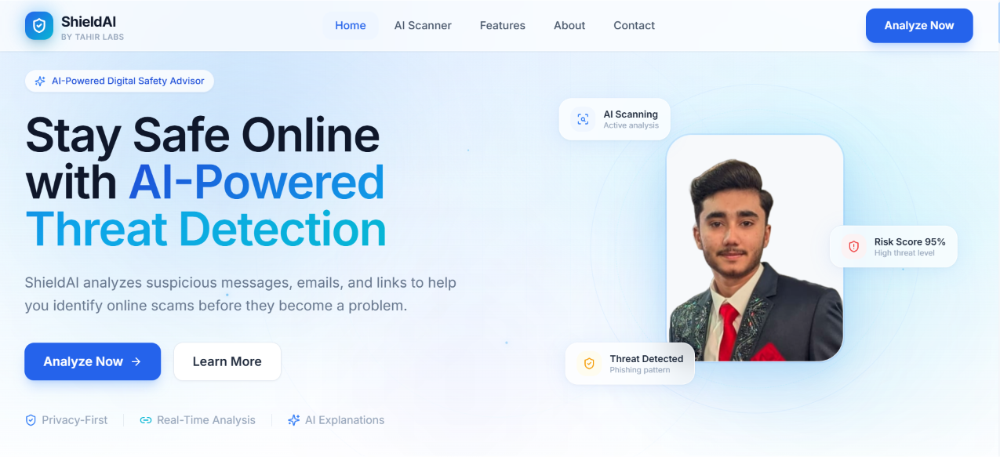
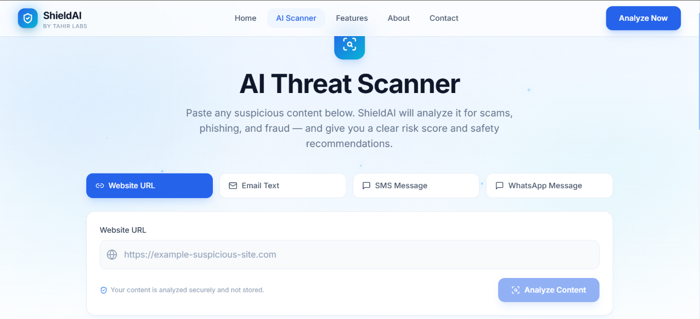
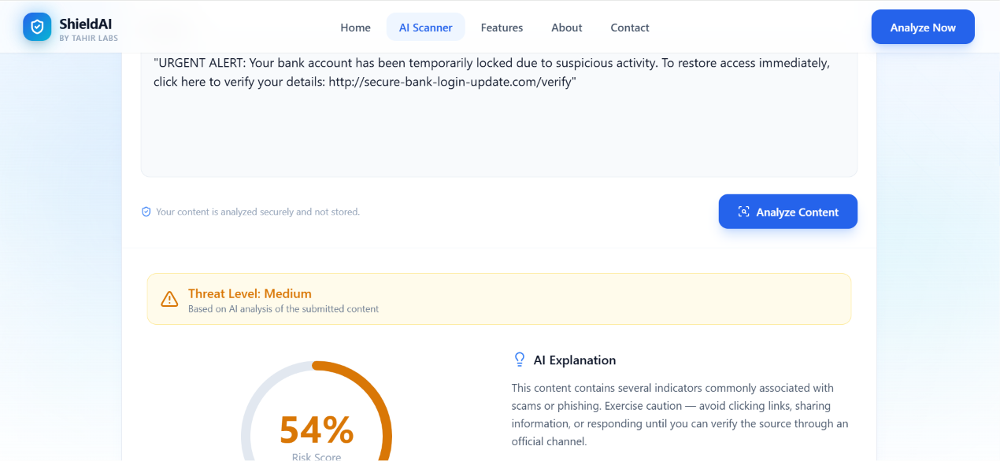

# 🛡️ ShieldAI by Tahir Labs

> Your AI-powered protection against online scams and digital threats.

 🌐 Live Demo

🔗shield-ai-azure-nine.vercel.app

---

 📌 About The Project

ShieldAI is an AI-powered Digital Safety Advisor that helps users detect phishing attempts, scam messages, suspicious emails, unsafe links, and other online threats.

The purpose of ShieldAI is to solve a real-world problem: many people receive suspicious digital content but cannot identify whether it is safe or dangerous.

ShieldAI uses AI to analyze potential threats and provide users with risk insights and safety recommendations.

---

 🎯 Problem It Solves

Online scams and phishing attacks are increasing rapidly. Users often struggle to identify:

- Fake messages
- Phishing emails
- Suspicious links
- Scam offers
- Digital fraud attempts

ShieldAI helps users make safer decisions before interacting with risky content.

---

 ✨ Features

- 🤖 AI Scam Detection
- 🎣 Phishing Detection
- 🔗 URL Safety Analysis
- 📧 Email Analysis
- 💬 Message Analysis
- 📊 Risk Score Generation
- 🛡️ Threat Explanation
- 💡 Safety Recommendations
- 🔐 Privacy-focused Security Insights

---

 🧠 AI Feature

ShieldAI includes an AI security assistant that analyzes suspicious content and explains possible risks.

 AI System Prompt

```
You are ShieldAI, an AI cybersecurity assistant.

Analyze user-provided messages, emails, or URLs.

Identify possible scams, phishing attempts, fraud patterns, and security risks.

Generate:
- Risk score
- Threat level
- Security explanation
- Safety recommendations

Always provide clear and accurate security guidance.
```

---

 🛠️ Technology Stack

 Frontend
- Next.js
- React
- TypeScript
- Tailwind CSS
- Framer Motion

 AI
- Gemini API / AI Model

 Deployment
- Vercel

 Tools
- GitHub
- VS Code

---

 📸 Screenshots

 Home Page



## AI Scanner



 Threat Analysis Result



---

 🚀 How To Run Locally

Clone the repository:

```bash
git clone YOUR_GITHUB_REPOSITORY_LINK
```

Install dependencies:

```bash
npm install
```

Create environment variables:

```
GEMINI_API_KEY=your_api_key
```

Run the project:

```bash
npm run dev
```

Open:

```
http://localhost:3000
```

---
  🔮 Future Improvements

- Browser security extension
- Mobile application
- Real-time threat intelligence
- Advanced AI security models

---

 👨‍💻 Developer

Tahir Labs

Building AI-powered solutions for a safer digital future.

**Project:** ShieldAI

---

⭐ Built as a Final AI App Project